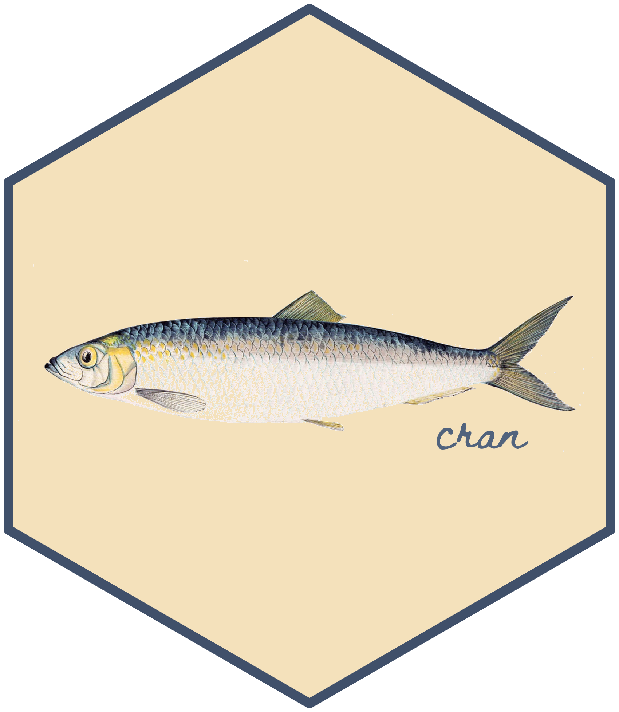
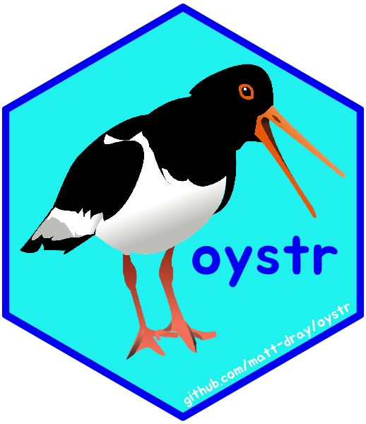
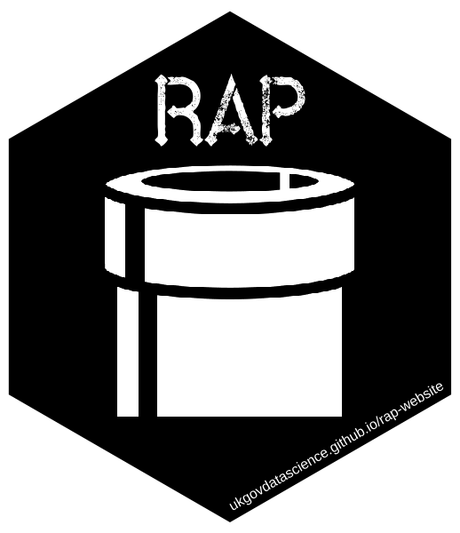

# About

A place to store code for creating stickers and output images.

The stickers here use either [{hexSticker}](https://github.com/GuangchuangYu/hexSticker) package by Guangchuang Yu, or [{magick}](https://github.com/ropensci/magick) and [{bunny}](https://github.com/dmi3kno/bunny) via Jeroen Ooms and Dmytro Perepolkin, respectively. See examples of stickers on [hexbin](http://hexb.in).

Code is in the `R/` subfolder; output images in `output/`. Image sources listed in [`img/README.md`](https://github.com/matt-dray/stickers/blob/master/img/README.md) and font sources listed in [`font/README.md`](https://github.com/matt-dray/stickers/blob/master/font/README.md)

# Stickers

## Sites

[rostrum.blog](https://www.rostrum.blog)-themed. Idea extended for 'business-card hex-stickers' (as per [this tweet](https://twitter.com/mattdray/status/923837532789526528)). Version 2 under development.

## R packages

These are some R packages I've made:

* {altcheckr} ([site](https://matt-dray.github.io/altcheckr/), [blog](https://www.rostrum.blog/2019/12/08/altcheckr/))
* {cran} ([source](https://matt-dray.github.io/cran/), [blog](https://www.rostrum.blog/2020/09/12/herring-units/))
* {ghdump} ([site](https://www.github.com/matt-dray/ghdump/), [blog](https://www.rostrum.blog/2020/06/14/ghdump/))
* {kevinbacran} ([site](https://matt-dray.github.io/kevinbacran/), [blog](https://www.rostrum.blog/2019/02/27/hadley-number/))
* {oystr} ([site](https://matt-dray.github.io/oystr/), [blog](https://www.rostrum.blog/2019/12/23/oystr/))
* {r2eng} ([site](https://www.github.com/matt-dray/r2eng/), [blog]())

## Reproducible Analytical Pipelines (RAP)

Created for [Dr Mat Gregory](https://twitter.com/mammykins_) and [Dr Matt Upson](https://twitter.com/m_a_upson) in support of [Reproducible Analytical Pipelines (RAP)](https://ukgovdatascience.github.io/rap-website). Read [this GOV.UK blog](https://dataingovernment.blog.gov.uk/2017/03/27/reproducible-analytical-pipeline/) for more. See the sticker in the [RAP companion documentation](https://github.com/ukgovdatascience/rap_companion) and [MOOC](https://www.udemy.com/reproducible-analytical-pipelines/), or in the wild (printed by [Dr Matt Upson](https://github.com/ivyleavedtoadflax), e.g. see image in [this blog](https://dataingovernment.blog.gov.uk/2017/11/27/transforming-the-process-of-producing-official-statistics/)). Version 3 (black and white) by [Duncan Garmonsway](https://twitter.com/nacnudus) for better integration with GOV.UK design system. Version 4 to celebrate RAP winning the inaugural Government Statistical Service Collaboration Award in 2019.

