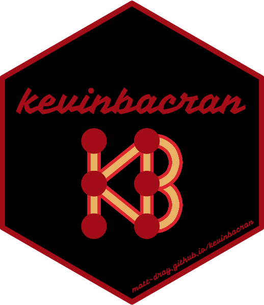
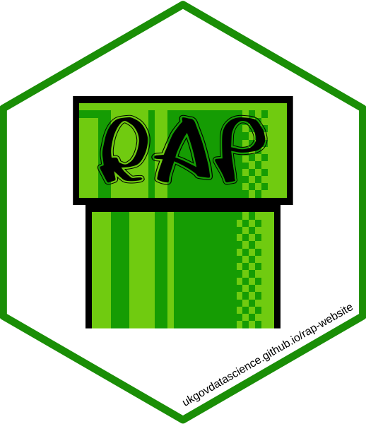

# About

A place to store code for creating stickers and output images.

[`hexSticker`](https://github.com/GuangchuangYu/hexSticker) package by [Guangchuang Yu](https://github.com/GuangchuangYu). Examples [here](http://hexb.in).

# Stickers

## Packages

* The [{kevinbacran}](https://matt-dray.github.io/kevinbacran/){target="_blank"} package (see [blog](https://www.rostrum.blog/2019/02/27/hadley-number/){target="_blank"})
* The [{oystr}](https://matt-dray.github.io/oystr/){target="_blank"} package
* The [{altcheckr}](https://matt-dray.github.io/altcheckr/){target="_blank"} package (see [blog](https://www.rostrum.blog/2019/12/08/altcheckr/){target="_blank"})

## Reproducible Analytical Pipelines (RAP)

Created for [Dr Mat Gregory](https://twitter.com/mammykins_) and [Dr Matt Upson](https://twitter.com/m_a_upson) in support of [Reproducible Analytical Pipelines (RAP)](https://ukgovdatascience.github.io/rap-website). Read [this GOV.UK blog](https://dataingovernment.blog.gov.uk/2017/03/27/reproducible-analytical-pipeline/) for more. See the sticker in the [RAP companion documentation](https://github.com/ukgovdatascience/rap_companion) and [MOOC](https://www.udemy.com/reproducible-analytical-pipelines/), or in the wild (printed by [Dr Matt Upson](https://github.com/ivyleavedtoadflax), e.g. see image in [this blog](https://dataingovernment.blog.gov.uk/2017/11/27/transforming-the-process-of-producing-official-statistics/)). Version 3 by [Duncan Garmonsway](https://twitter.com/nacnudus) for better integration with GOV.UK design system. Version 4 to celebrate RAP winning the inaugural Government Statistical Service Collaboration Award in 2019.

## rostrum.blog

Created to complement the [Rostrum](https://www.rostrum.blog) blog. Idea extended for a business-card hex-sticker (as per [this tweet](https://twitter.com/mattdray/status/923837532789526528)).

