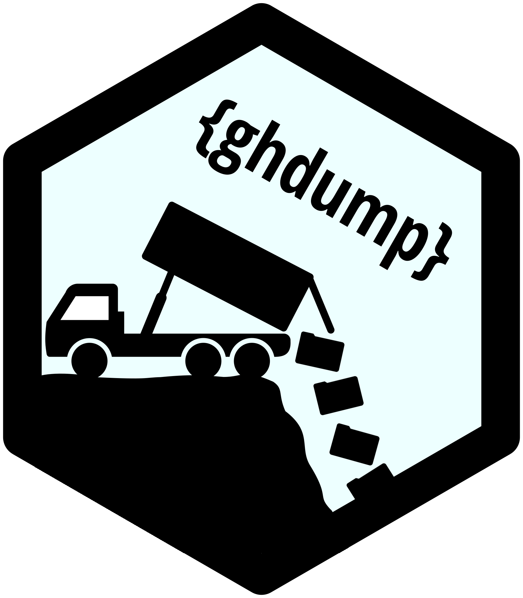
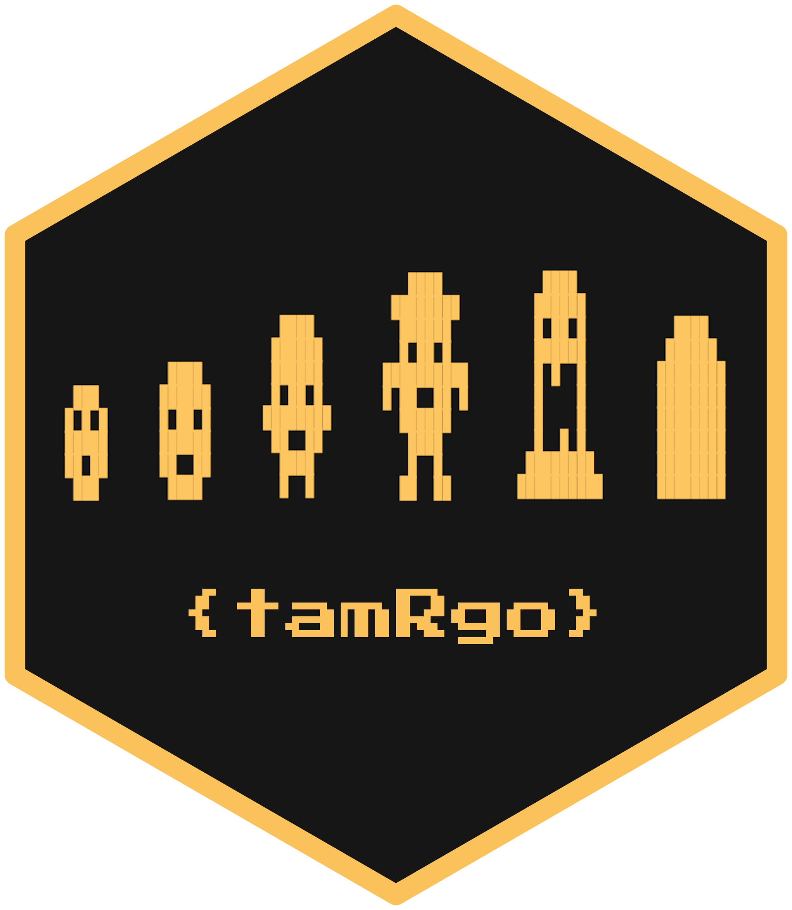

# About

A place to store code for creating hex stickers and output images.

The hexes here were made using one of:

* [{hexSticker}](https://github.com/GuangchuangYu/hexSticker) package by Guangchuang Yu
* [{magick}](https://github.com/ropensci/magick) and [{bunny}](https://github.com/dmi3kno/bunny) via Jeroen Ooms and Dmytro Perepolkin, respectively
* [The Hexmake Shiny app](https://connect.thinkr.fr/hexmake/) by Colin Fay

Code is in the `R/` subfolder; output images in `output/`. Image sources listed in [`img/README.md`](https://github.com/matt-dray/stickers/blob/master/img/README.md) and font sources listed in [`font/README.md`](https://github.com/matt-dray/stickers/blob/master/font/README.md).

# Hex stickers

## R packages

Find out about these packages, and more, [on my projects page](https://matt-dray.github.io/projects/).

## Sites

Logo designs for [rostrum.blog](https://www.rostrum.blog). Version 2 was created to take advantage of [{pixeltrix}](https://github.com/matt-dray/pixeltrix) and intended for the future of the blog.

## Reproducible Analytical Pipelines (RAP)

Created for [Dr Mat Gregory](https://twitter.com/mammykins_) and [Dr Matt Upson](https://twitter.com/m_a_upson) in support of [Reproducible Analytical Pipelines (RAP)](https://ukgovdatascience.github.io/rap-website). Read [this GOV.UK blog](https://dataingovernment.blog.gov.uk/2017/03/27/reproducible-analytical-pipeline/) for more. See the sticker in the [RAP companion documentation](https://github.com/ukgovdatascience/rap_companion) and [MOOC](https://www.udemy.com/reproducible-analytical-pipelines/), or in the wild (printed by [Dr Matt Upson](https://github.com/ivyleavedtoadflax), e.g. see image in [this blog](https://dataingovernment.blog.gov.uk/2017/11/27/transforming-the-process-of-producing-official-statistics/)). Version 3 (black and white) by [Duncan Garmonsway](https://twitter.com/nacnudus) for better integration with GOV.UK design system. Version 4 to celebrate RAP winning the inaugural Government Statistical Service Collaboration Award in 2019.

## Misc

A 'business card' hex-sticker as per [this tweet](https://twitter.com/mattdray/status/923837532789526528).

